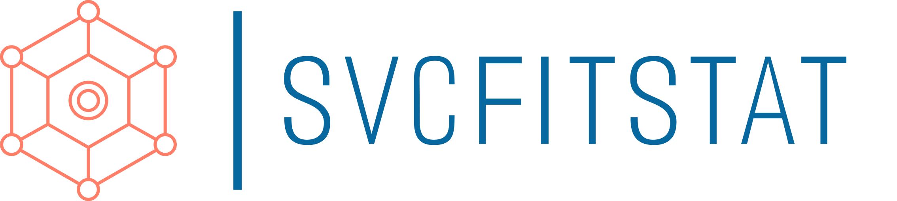

<p align="center">

</p>
## Discontinuation notice

Dear Capsuleers,

It is with regret that I write to inform you that the pyfa-cli and svcfitstat projects are being discontinued. The reason for this decision is the transfer of the related Abyss Tracker project to EVE Workbench.

It has been an honor and a privilege to work on this project and I would like to express my sincere gratitude to all of you who have used and supported svcfitstat. Your feedback and contributions have been invaluable and have helped shape the project into what it is today.

Although this marks the end of this project, I am confident that the move of the Abyss Tracker to EVE Workbench will lead to even greater success and advancements in the future. I encourage you to continue to follow the developments on EVE Workbench and support the ongoing efforts of the new maintainers.

Thank you again for your support and understanding.

Fly safe,

Veetor

# Introduction
This repository focuses on how the [CLI modified Pyfa](https://github.com/molbal/Pyfa) runs in Docker and how it is exposed

Please see the [svcfitstat](https://github.com/molbal/svcfitstat) repository for the full solution, with an architecture diagram. 

# Usage
The image is published in Docker Hub, so usage is straightforward:

`docker pull molbal/svcfitstat`

https://hub.docker.com/r/molbal/svcfitstat

## Webservice calls
By default the container listens on port 80. There is only one endpoint, which takes both *GET* and *POST* requests. GET requests are trivial and POST requests have to made as if html form submitted it. (So the content type must be `application/x-www-form-urlencoded`)

### Parameters
At all times returned content will have the `Content-type: application/json` header and will be a valid json. One exception could be a severely broken input that makes Pyfa hang.

|Parameter|Methods|Description|Mandatory|
|---|---|---|---|
|secret|GET,POST|Secret key, defined in the SFS_SECRET environment variable|Yes, if set in the environment variable|
|fit|GET, POST|The fit, in EFT format. You should make sure it is a valid format, because the wrapper does not check it, just feeds it to Pyfa. If supplied via GET parameter, it passes through PHP's [urldecode](https://www.php.net/manual/en/function.urldecode.php) function, so encode it properly. If via POST, it is not urldecoded.|

### Example request

***Request***

Container start command:

`docker run -p 82:80 -e SFS_SECRET=a molbal/svcfitstat:0.9.2`


Then GET request:

`http://127.0.0.1:82/index.php?fit=[Nergal%2C+Nergsdfasdfl+fit]%0A%0ASmall+Armor+Repairer+II%0AAssault+Damage+Control+II%0AAdaptive+Nano+Plating+II%0AAdaptive+Nano+Plating+II%0A%0ASmall+Hull+Repairer+II%0ASmall+Shield+Booster+I%0ASmall+Compact+Pb-Acid+Cap+Battery%0A%0ALight+Entropic+Disintegrator+I%2C+Tetryon+Exotic+Plasma+S%0A[Empty+High+slot]%0A%0ASmall+Anti-Kinetic+Pump+I%0ASmall+Anti-Kinetic+Pump+I%0A%0AHobgoblin+II+x5&secret=a`

***Output***
```json
{
  "success": true,
  "stats": {
    "offense": {
      "totalDps": 398.48,
      "weaponDps": 299.48,
      "droneDps": 99,
      "totalVolley": 584.67
    },
    "defense": {
      "ehp": {
        "total": 9507.26030244436,
        "shield": 540.5405405405405,
        "armor": 6790.102846480932,
        "hull": 2176.6169154228855
      },
      "resists": {
        "shield": {
          "em": 0.075,
          "therm": 0.5375,
          "kin": 0.445,
          "exp": 0.8612
        },
        "armor": {
          "em": 0.736,
          "therm": 0.868,
          "kin": 0.7561,
          "exp": 0.8152
        },
        "hull": {
          "em": 0.598,
          "therm": 0.598,
          "kin": 0.598,
          "exp": 0.598
        }
      },
      "reps": {
        "burst": {
          "shieldRegen": 2.88,
          "shieldBoost": 24.98,
          "armor": 99.16,
          "hull": 4.15,
          "total": 131.17
        },
        "sustained": {
          "shieldRegen": 2.88,
          "shieldBoost": 7.37,
          "armor": 99.16,
          "hull": 0,
          "total": 109.41
        }
      }
    },
    "misc": {
      "ship": {
        "id": 52250,
        "name": "Nergal",
        "cpuMax": 187.5,
        "powerMax": 68.75,
        "cpuUsed": 144.75,
        "pgUsed": 54,
        "calibrationUsed": 100,
        "warpSpeed": 5.5
      },
      "drones": {
        "activeDrones": 5,
        "droneBayTotal": 25,
        "droneBandwidthUsed": 25,
        "droneBayUsed": 25
      },
      "maxSpeed": 321.46,
      "signature": 36,
      "capacitor": {
        "capacity": 821.25,
        "stable": false,
        "stableAt": null,
        "lastsSeconds": 72
      },
      "targeting": {
        "range": 56250,
        "resolution": 800,
        "strength": 16.8
      }
    }
  },
  "debug": {
    "rawoutput": "\n(pyfa.py:27): Gtk-WARNING **: 08:56:55.636: Could not load a pixbuf from /org/gtk/libgtk/theme/Adwaita/assets/bullet-symbolic.svg.\nThis may indicate that pixbuf loaders or the mime database could not be found.\n{\"offense\": {\"totalDps\": 398.48, \"weaponDps\": 299.48, \"droneDps\": 99.0, \"totalVolley\": 584.67}, \"defense\": {\"ehp\": {\"total\": 9507.26030244436, \"shield\": 540.5405405405405, \"armor\": 6790.102846480932, \"hull\": 2176.6169154228855}, \"resists\": {\"shield\": {\"em\": 0.075, \"therm\": 0.5375, \"kin\": 0.445, \"exp\": 0.8612}, \"armor\": {\"em\": 0.736, \"therm\": 0.868, \"kin\": 0.7561, \"exp\": 0.8152}, \"hull\": {\"em\": 0.598, \"therm\": 0.598, \"kin\": 0.598, \"exp\": 0.598}}, \"reps\": {\"burst\": {\"shieldRegen\": 2.88, \"shieldBoost\": 24.98, \"armor\": 99.16, \"hull\": 4.15, \"total\": 131.17}, \"sustained\": {\"shieldRegen\": 2.88, \"shieldBoost\": 7.37, \"armor\": 99.16, \"hull\": 0.0, \"total\": 109.41}}}, \"misc\": {\"ship\": {\"id\": 52250, \"name\": \"Nergal\", \"cpuMax\": 187.5, \"powerMax\": 68.75, \"cpuUsed\": 144.75, \"pgUsed\": 54.0, \"calibrationUsed\": 100.0, \"warpSpeed\": 5.5}, \"drones\": {\"activeDrones\": 5, \"droneBayTotal\": 25.0, \"droneBandwidthUsed\": 25.0, \"droneBayUsed\": 25.0}, \"maxSpeed\": 321.46, \"signature\": 36.0, \"capacitor\": {\"capacity\": 821.25, \"stable\": false, \"stableAt\": null, \"lastsSeconds\": 72.0}, \"targeting\": {\"range\": 56250.0, \"resolution\": 800.0, \"strength\": 16.8}}}\n",
    "fit": "[Nergal, Nergsdfasdfl fit]\n\nSmall Armor Repairer II\nAssault Damage Control II\nAdaptive Nano Plating II\nAdaptive Nano Plating II\n\nSmall Hull Repairer II\nSmall Shield Booster I\nSmall Compact Pb-Acid Cap Battery\n\nLight Entropic Disintegrator I, Tetryon Exotic Plasma S\n[Empty High slot]\n\nSmall Anti-Kinetic Pump I\nSmall Anti-Kinetic Pump I\n\nHobgoblin II x5",
    "command": "xvfb-run python3.6 /pyfa/pyfa.py -r -l Critical -f W05lcmdhbCwgTmVyZ3NkZmFzZGZsIGZpdF0KClNtYWxsIEFybW9yIFJlcGFpcmVyIElJCkFzc2F1bHQgRGFtYWdlIENvbnRyb2wgSUkKQWRhcHRpdmUgTmFubyBQbGF0aW5nIElJCkFkYXB0aXZlIE5hbm8gUGxhdGluZyBJSQoKU21hbGwgSHVsbCBSZXBhaXJlciBJSQpTbWFsbCBTaGllbGQgQm9vc3RlciBJClNtYWxsIENvbXBhY3QgUGItQWNpZCBDYXAgQmF0dGVyeQoKTGlnaHQgRW50cm9waWMgRGlzaW50ZWdyYXRvciBJLCBUZXRyeW9uIEV4b3RpYyBQbGFzbWEgUwpbRW1wdHkgSGlnaCBzbG90XQoKU21hbGwgQW50aS1LaW5ldGljIFB1bXAgSQpTbWFsbCBBbnRpLUtpbmV0aWMgUHVtcCBJCgpIb2Jnb2JsaW4gSUkgeDU="
  }
}
```

## Resources
When idle an unused, the container uses *20MB* of memory. When used it peaks at around *350-400 MB* and then returns to *150-200 MB* idle memory. The container size is *1.69 GB*

## Technical solution
It was challanging to get it working. The container uses a CentOS 7 base image and has installs following software:

|Package name|What for?|
|---|---|
|python36u|Python environment|
|python36u-libs|Python environment|
|python36u-devel|Python environment|
|python36u-pip|Python package manager|
|git|Getting modified pyfa|
|gcc-c++|A wxWidgets is a dependency of Pyfa and we need to compile it|
|make|A wxWidgets is a dependency of Pyfa and we need to compile it|
|which|A wxWidgets is a dependency of Pyfa and we need to compile it|
|gtk3|Pyfa dependency|
|gtk3-devel|Pyfa dependency|
|xorg-x11-server-Xvfb|Emulating a display|
|httpd|Exposing Pyfa CLI|
|yum-utils|For adding a repository to yum|
|php|v7.4, the wrapper script|
|php-opcache|minor performance boost for the wrapper|
|python/pathlib2|Pyfa building requirement|

It builds the modified pyfa's dependencies and simulates a virtual screen where it can run. 
I modified it earlier so it also prints the stats to stdout, which is more than enough for us. 
Its process terminates after that and the [wrapper script](index.php) can parse its results.

During build period a pre-built eve.db is entered to shorten the build time.

## Version numbers
The first part of version will refer to the integration built around pyfa, and the second part is the base pyfa's version.
So for example, 0.9-2.20.2 is for the 0.9 version for the integration layers, built around the 2.20.2 original Pyfa. 


# Configuration
The container can be configured with the followign environment variables:

|Name|Description|Default value if not set|
|---|---|---|
|SFS_FIT_MAX_LENGTH|Maximum length of input allowed (chars)|2048|
|SFS_MAX_EXEC_TIME|Maximum runtime of a single get (seconds)|15|
|SFS_ADDITIONAL_CMD|Additional command line parameters for Pyfa|`-r -l Critical`|
|SFS_SECRET|Secret key, that the web service asks for. If not set, specifying this key is unnecessary.|not set|

# Future
The container size is 1.69GB which is a bit heavy. Also, building the image is longer than I would like (10m+).
